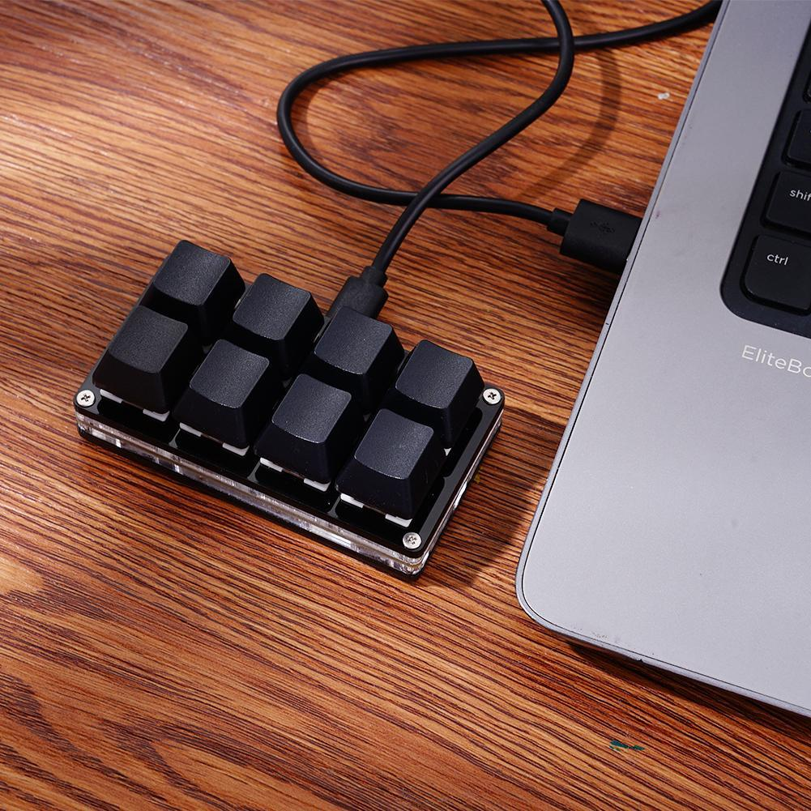
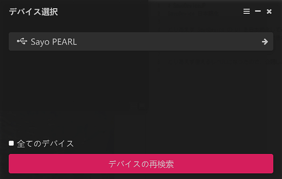
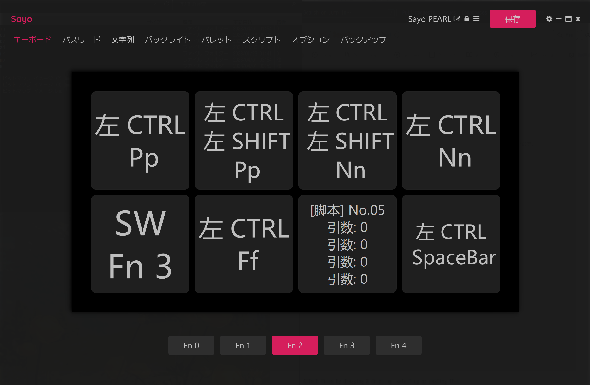
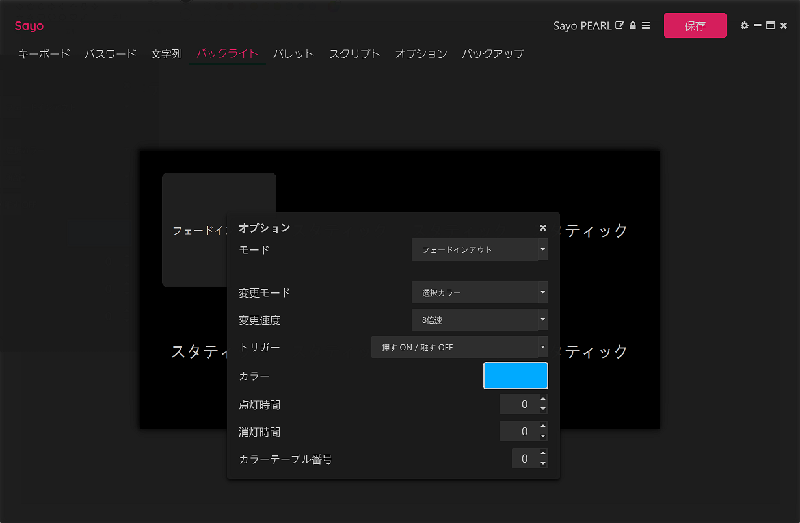

# SayoDeviceJP
SayoDevice 日本語化

とりあえず SayoDevice の UI を日本語化してみました。

本家にバグがたくさんあり、文字列を変更できない場所や、簡体字入力手段を持ってないので、
追従できることが限られます。 
また中華フォントなのも、ソフトの都合でソースがありませんので、変更できません。

とりあえず使えるレベルになったので、公開します。

本家は<a href="https://github.com/SoulDee/WebSayoDevice">こちら</a>です。 
本家ダウンロードは<a href="https://dl.sayobot.cn/setting_v3.zip">こちら</a>です。 

