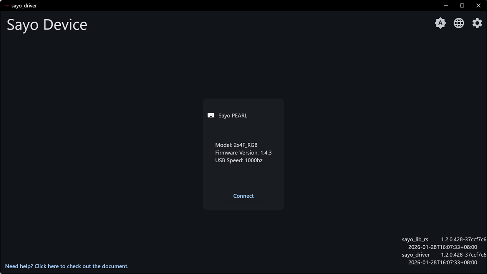
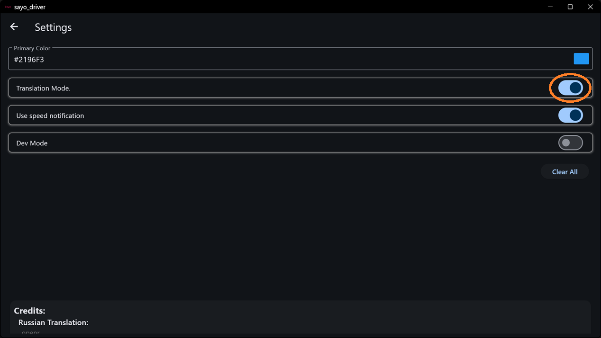
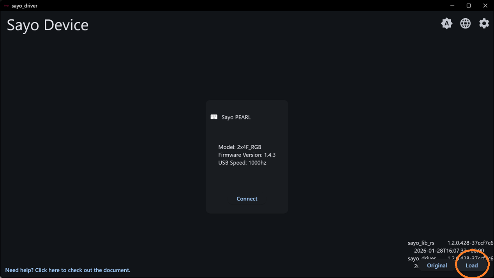
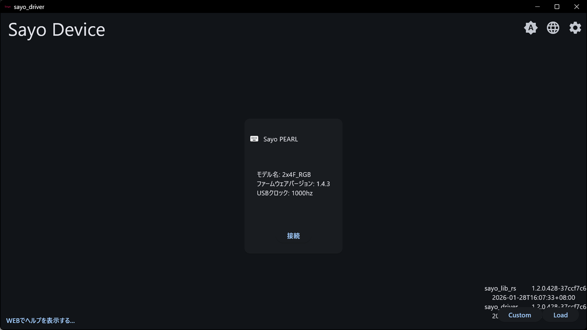
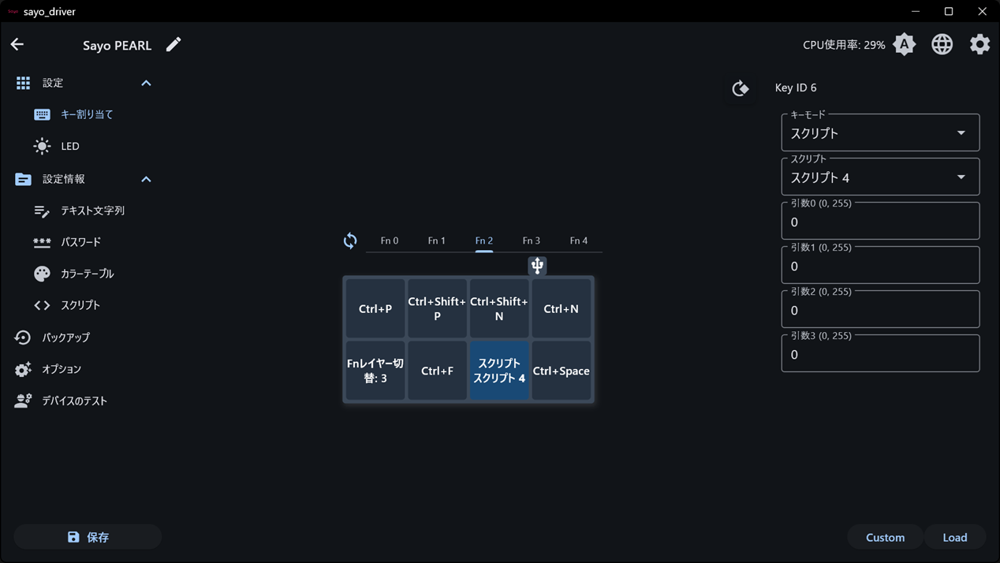

# SayoDevice 日本語化

起動後、右上の「歯車」をクリックして設定を開く。

「Translation Mode.」を有効にし、左上の「←」でタイトルに戻る。

右下の「Load」をクリックし、別途ダウンロードした言語ファイル「app_ja.arb」を選択する。

右下の「Original」をクリックして「Key」から「Custom」に変更すると、日本語になります。

必要箇所しか翻訳していませんが、日本語化できます。

