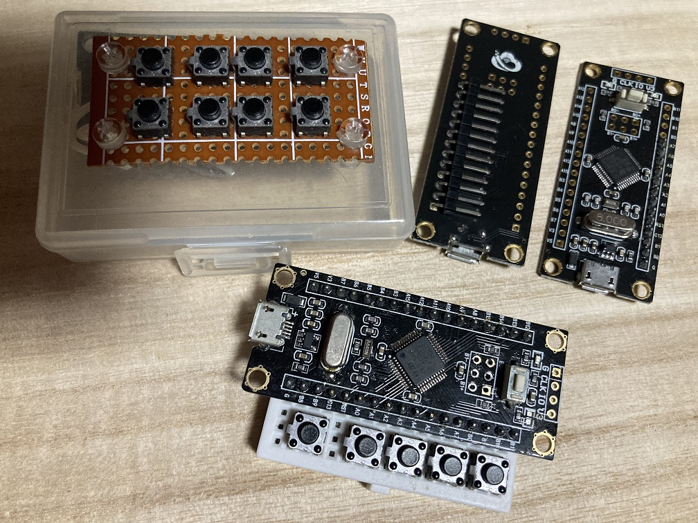

# 入手方法

通販の AliExpress や Amazon で入手できます。 
価格は約1,000円～3,500円ぐらいとバラバラです。

安くて送料無料の店で良いと思われます。私は、AliExpress で買いました。 

ただし SayoDevice と、見た目は似ているけど、違うものもあります。 
※ 特に回転式のつまみが付いている物は、ソフトが違うようです。

ボタン数は、好きなもので良いと思われます。私は 4x2 の 8ボタン ですが、 
ページ切り替え機能があり、最大 40個 の機能割り当てが可能です。

# 内容物

写真の通り、本体と Type-Cケーブル、説明書？(ダウンロードページのQRコードが付いてる) 
だけです。箱などもありません。
作りは、かなりしっかり作られており、安っぽさはありません。 
裏面には、滑り止めのゴム足も付いています。

# 少し分解

キーキャップを外すと、中華製の赤軸、それもホットスワップ可能です。 
LEDは、基盤に埋め込まれており、取り外しや交換は出来ません。

CherryMX や Kailh に交換可能かと思われますが、CherryMX は固くてうまく刺さりませんでした。 
モノ自体は3ピンと言われる、信号2本と真ん中の穴しかありません。 
5ピンなどは、工夫が必要です。

キーキャップは、DSAではなく、R1～R4のどれかと思われますが、違う気もします。 
2段に違いはなく、全てに同じキャップが付いています。

# それまでは。。。

全ての環境を SayoDevice に移したのですが、それまでは、STM32 を使って自作のキーボードを 
作っていました。プログラムで長押しや、ダブルタップ、スイッチなど好きに作れるのですが、 
内容を変更したい場合、プログラム変更～コンパイルが面倒でしたし、何より見た目が。。。 

