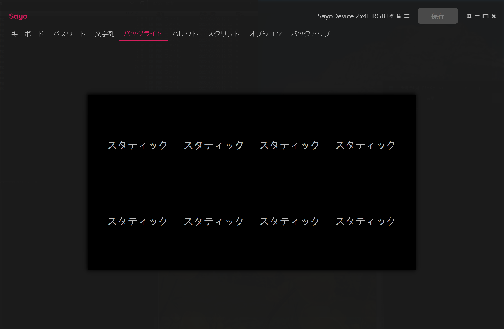
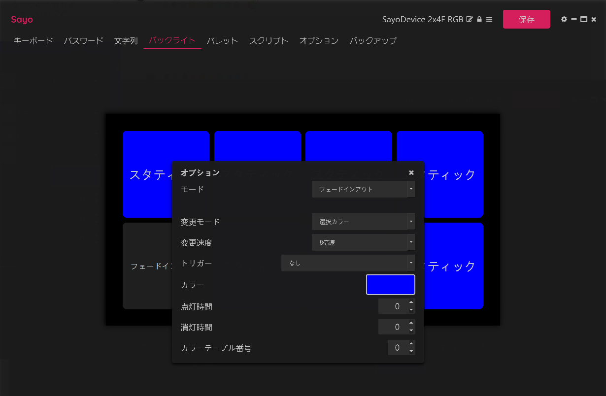

# ページ切り替えで使えるボタン数を増やそう

ページという概念をもっており、その切り替えにより複数のボタンセットが使えます。<br>
Fn0～Fn4 の 5セット を切り替えることが出来ます。<br>
ただし 8ボタン のうち1つを切り替えに使いますので、使えるボタンは 7個×5セット になります。<br>
<br>
これにより動画再生セット、ゲーム専用連射ボタン、配信用のボタンセット、など複数のシーンに合わせた使い方が出来ます。<br>
<br>

## 左下のボタンをページ切り替えに割り当てる方法を説明します(もちろん他のボタンでも可能です)。
<br>

```
下段「Fn0」を指定し「左下のボタン5%(デフォルトでは5が入力されるように設定されている)」を選択する。
```
<br>

```
「モード」を「SW」に設定し、「選択Fn」を次のページである「Fn1」を指定する。
```
 <br>

```
下段「Fn1」に切り替え、「左下のボタン」を選択し「モード」を同じく「SW」に設定し、「選択Fn」を次のページである「Fn2」を指定する。
```
<br>

```
同じく「Fn2、Fn3、Fn4」を設定するが、「Fn4」の次ページを元に戻すために「Fn0」を指定する。
```
<br>

<br>
<br>
<br>

<br>
<br>
<br>

<br>
<br>
<br>

<br>
<br>
<br>

<br>
<br>
<br>

<br>
<br>
<br>

<br>
<br>
<br>
