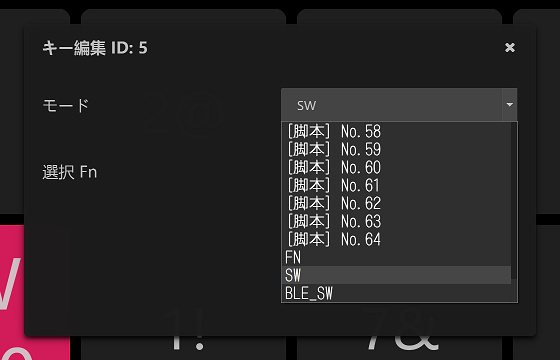
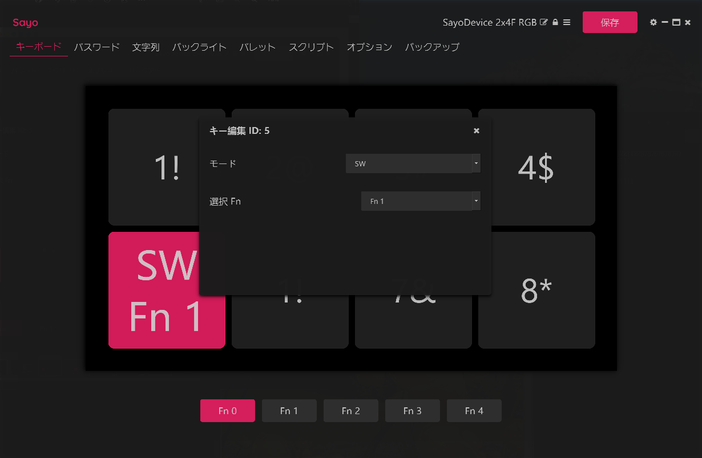
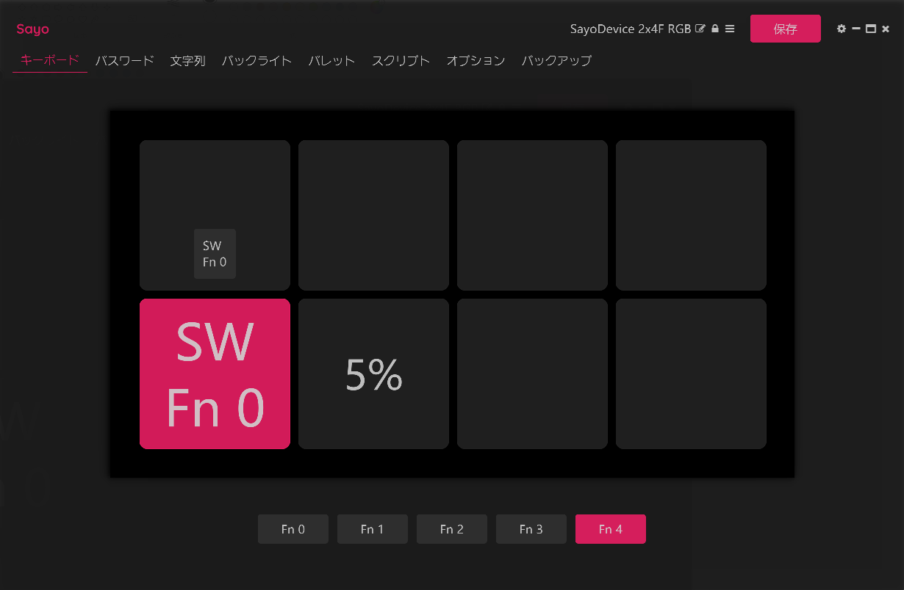
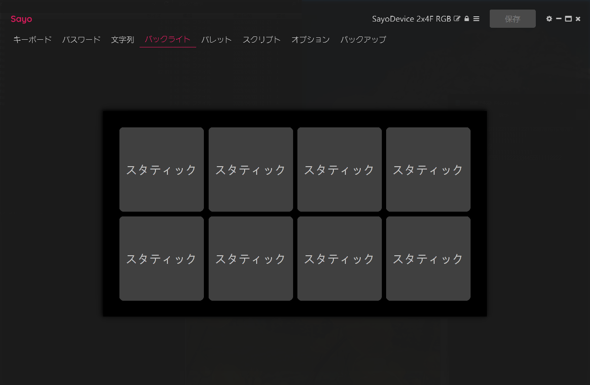

# ページ切り替えで使えるボタン数を増やそう

ページという概念をもっており、その切り替えにより複数のボタンセットが使えます。 
Fn0～Fn4 の 5セット を切り替えることが出来ます。ただし 8ボタン のうち1つを切り替えに使いますので、使えるボタンは 7個×5セット になります。 
 
これにより動画再生セット、ゲーム専用連射ボタン、配信用のボタンセット、など複数のフェーズに合わせた使い方が出来ます。 

 
 
 

 
 
 

 
 
 

 
 
 

 
 
 

 
 
 

 
 
 

 
 
 

 
 
 

 
 
 

 
 
 

 
 
 

 
 
 

 
 
 
