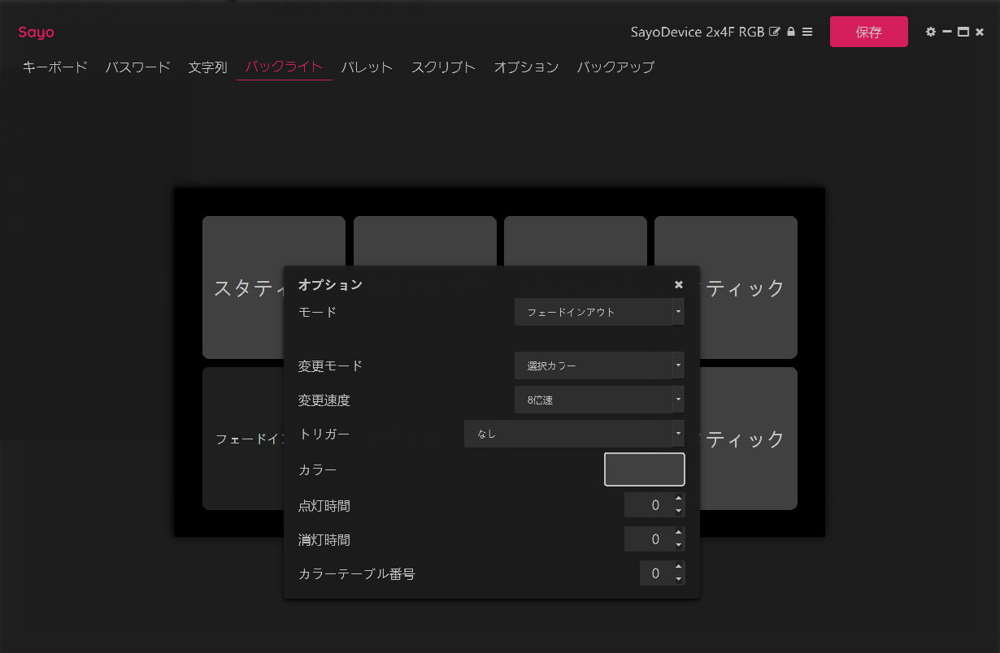
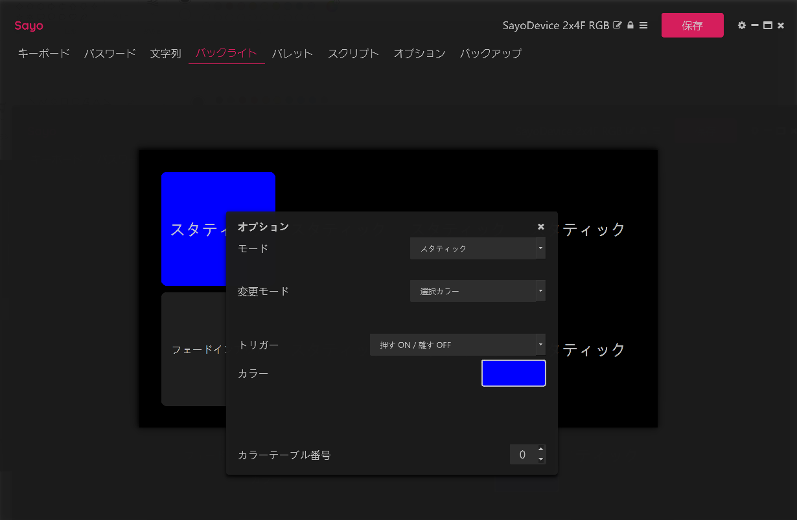
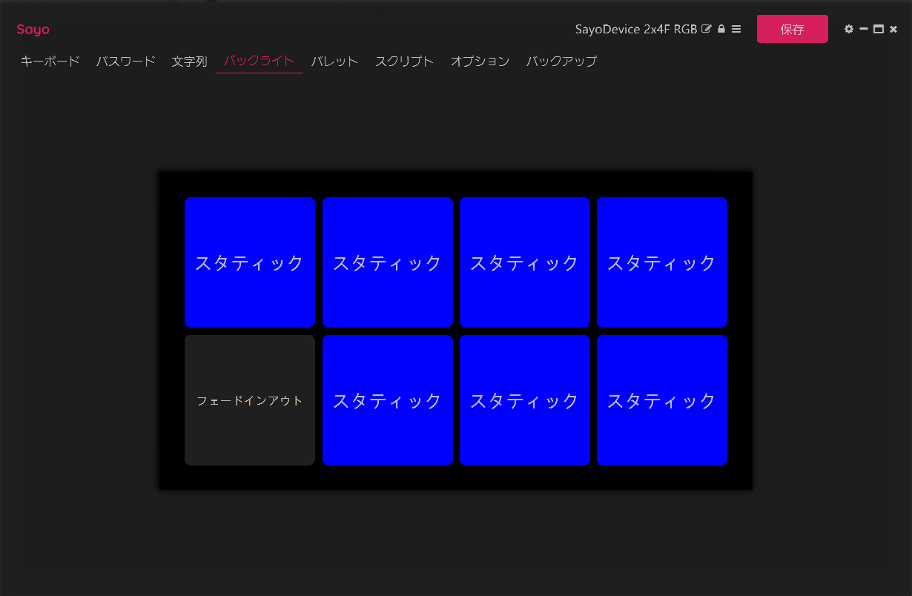

# ページ切り替えで使えるボタン数を増やそう

ページという概念をもっており、その切り替えにより複数のボタンセットが使えます。<br>
Fn0～Fn4 の 5セット を切り替えることが出来ます。<br>
ただし 8ボタン のうち1つを切り替えに使いますので、使えるボタンは 7個×5セット になります。<br>
<br>
これにより動画再生セット、ゲーム専用連射ボタン、配信用のボタンセット、など複数のシーンに合わせた使い方が出来ます。<br>
<br>

## 左下のボタンをページ切り替えに割り当てる方法を説明します(他のボタンでも可)。
<br>

```
下段「Fn0」を指定し「左下のボタン5%(デフォルトでは5が入力されるように設定されている)」を選択する。
```
<br>

```
「モード」を「SW」に設定し、「選択Fn」を次のページである「Fn1」を指定する。
```
 <br>

```
下段「Fn1」に切り替え、「左下のボタン」を選択し「モード」を同じく「SW」に設定し、「選択Fn」を次のページである「Fn2」を指定する。
```
<br>

```
同じく「Fn2、Fn3、Fn4」を設定するが、「Fn4」の次ページを元に戻すために「Fn0」を指定する。
```
<br>
<br>
ここまで設定すれば、左下のボタンを押すたびに Fn0～Fn4 を順番に切り替えて、複数のボタンセットが使えます。<br>
> しかしページが切り替わったことや、現在のページが分かりませんので、バックライトにより分かりやすく設定します。<br>
<br>

# バックライトの設定

各ボタンに LED が埋め込まれており、好きな色で点灯させることが可能です。点滅させたりフェードイン、フェードアウトさせることや、
RGB で細かい色の設定も可能です。<br>
> しかしこのソフトには、上記で設定したページという概念がバックライトにありません。<br>
> それを回避して設定することが可能ですので解説します。<br>
> ちなみにソフトのアップデートでも、ページの概念が搭載されることは無いと思われます。<br>

> 簡単に設定する方法をご存知の方は、ご教授お願いします。<br>

```
「設定したいページ」に切り替えてからソフトを起動し、「バックライトタブ」を選択する。
```
<br>

```
ページ切り替えに設定した、左下のボタンを選択する。
「モード」を「フェードインアウト」に設定し、「カラー」を好きな色に設定する。
```
> その他、変更速度などは、お好みで。<br>

 <br>

```
その他のボタンは、「モード」を「スタティック」に設定し、「トリガー」を「押すON/離すOFF」に設定する。
左下のフェードインアウト意外、全てのボタンを設定する。
```
 <br>
<br>
ここまで設定すると、左下のページ切り替えボタンが、常にフェードインアウトするので、現在のページが分かります。<br>
また他のボタンを押下すると設定した色で点灯しますので、ボタンの押下が分かりやすくなります。<br>
<br>
> 画面の色とボタンのLEDでは、かなり色味に違いがありますので、何度もテストを繰り返して設定することになります。<br>
<br>

## これで Fn0 というひとつのページの設定が出来ました。<br>

> 別のページを設定するには、ここで「ソフトを終了」し、「ページを切り替えてから」、「ソフトを起動」します。<br>
<br>
かなり面倒ですが、これを Fn0～Fn4 まで、繰り返し設定することにより、ページ毎にフェードインアウト、<br>
ボタン押下でボタンが点灯するようになります。<br>
<br>
> もちろんページ毎に色を変更しないと意味がありませんので、Fn0＝オレンジ、Fn1＝青、Fn2＝。。。と言う系統を<br>
> あらかじめ考えて設定します。<br>
<br>
ここではひとつの方法として、フェードインアウトと単純な押下ONを使いました。<br>
バックライトには、他にも設定がありますし、あらかじめ用意されたカラーパレットなども使えるようです。<br>
<br>
> カラーパレットが独特すぎるので、使い物になりませんが。。。<br>
