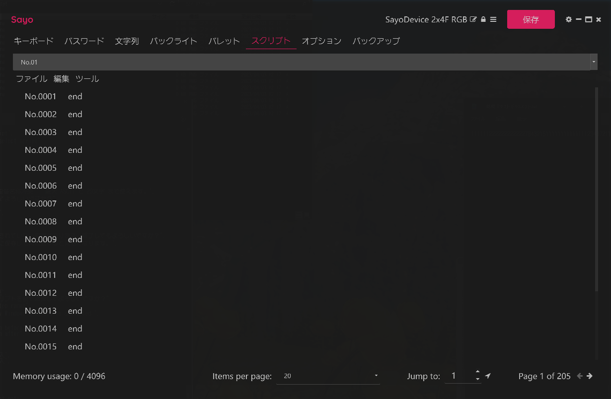
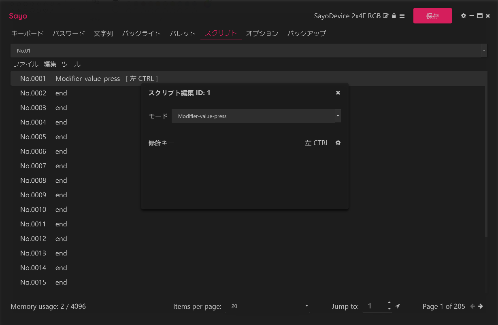
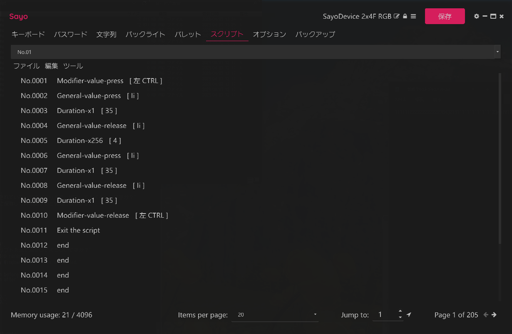
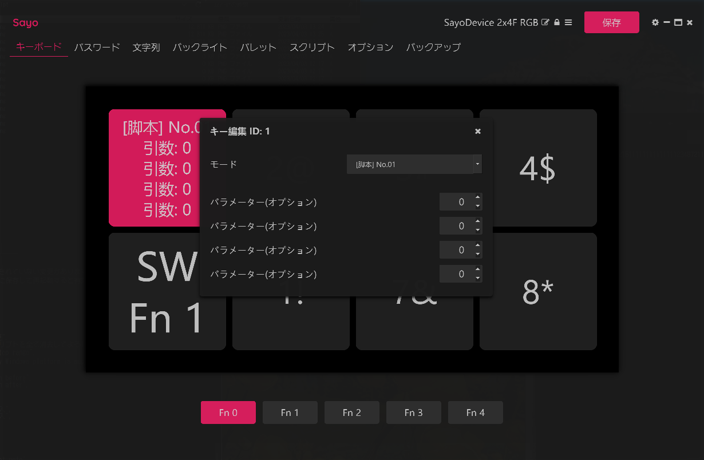
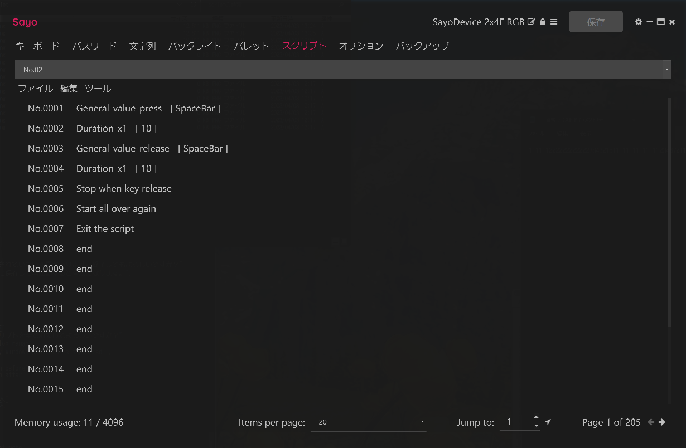
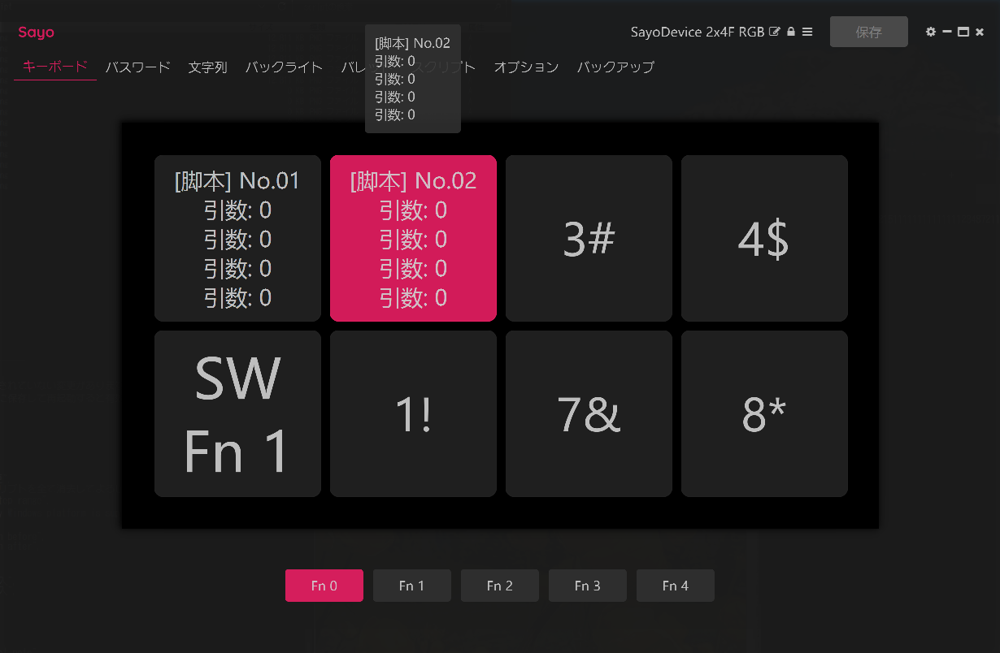

# スクリプトを使いこなそう
<br>

単純にキーボードのキーを割り当てたり、文字列をペーストするだけでは、SayoDevice のごく一部の機能しか使いこなせていません。<br>
スクリプトを使うと細かい制御が可能になります。<br>
スクリプトと言うとプログラムを書くと思われますが、実際には制御機能がありませんので、単に手順を羅列するだけです。<br>
<br>
もちろんプログラム経験も不要です。ただしミリ秒単位で制御しますので、根気よくトライし続けることが必要になります。<br>
要は根気さえあれば、思ったように動くスクリプトが完成します。慣れてくればコツも分かってきます。<br>
<br>

## ちょっと概要的なことを。。。
<br>

スクリプトを日本語で言い換えると、以下のような感じになります。<br>
```
A を押す
0.3秒 待機
A を離す
0.5 秒 待機

B を押す
0.3秒 待機
B を離す
0.5秒 待機

B を押す
0.3秒 待機
B を離す
```
実行結果は ABB と表示されるだけです。0.3秒 や 0.5秒 はゲームや PC の性能により調整します。<br>
単純に「A を押す」「A を離す」だけでは、スクリプトが早すぎて A が入力されなかったり、入力されたままになったりします。<br>
<br>
では、どの程度の数字が適当か？を、ここで記述することは出来ません。入力したいプログラムや PC の性能によって
異なるため、一概に 0.3秒 ですとは言い切れませんので、何度もトライが必要になります。<br>
<br>
根気よく頑張りましょう。<br>
<br>

## スクリプト容量には制限があります。
<br>

1本のスクリプトには 4,096行(ステップ)までしか登録できません。<br>
またスクリプトも 64本 までしか登録できません。<br>
それに 64本 と言っても、全ての合計が 4,096行 までしか登録できませんので、100行であれば 40本 しか登録できません。<br>
先述した ABB と表示するだけのスクリプトでも、11行もありますので、単純化するように心がけていないと、あっという間に足りなくなります。<br>
とはいえ、ゲームの連射や、プログラムのメニューを開いて設定を変更する程度であれば、ボタン一杯まで搭載可能です。<br>
<br>

# スクリプトを書いてみよう
<br>

「スクリプト」タブを押して、「No.01」と書かれたプルダウンを選択します。<br>


「No.0001」をクリックするとポップアップが開いて詳細を入力します。
```
「モード」    Modifier-value-press
「修飾キー」  左CTRL
```


## スクリプト容量には制限があります。
<br>





